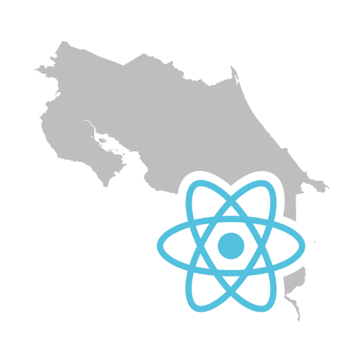

  

  
  
  

  
  
  
  

  <a href="https://reactcostarica.org">https://reactcostarica.org</a>

## Table of Contents

<!-- START doctoc generated TOC please keep comment here to allow auto update -->
<!-- DON'T EDIT THIS SECTION, INSTEAD RE-RUN doctoc TO UPDATE -->

- [Getting started](#getting-started)
- [Contributing guidelines](#contributing-guidelines)
- [Contributors](#contributors)
- [License](#license)

<!-- END doctoc generated TOC please keep comment here to allow auto update -->

## Getting started

1. Clone this repo
2. Run `yarn setup`
3. Run `yarn start`

## Contributing guidelines

1. Pick any [issue](./issues) or [create one](./issues/new)
2. Create a new topic branch off of `master`
3. Work on a feature proposal or bugfix and commit your changes
4. Create a PR to `master` with a descriptive title about what you did
5. You rock! 💖

## Contributors

<!-- ALL-CONTRIBUTORS-LIST:START - Do not remove or modify this section -->
<!-- prettier-ignore -->
<table>
  <tr>
    <td align="center"><a href="https://kevinwolf.me"> <b>Kevin Wolf</b></a> <a href="https://github.com/reactcostarica/website/commits?author=iamkevinwolf" title="Code">💻</a> <a href="#content-iamkevinwolf" title="Content">🖋</a> <a href="https://github.com/reactcostarica/website/commits?author=iamkevinwolf" title="Documentation">📖</a> <a href="#ideas-iamkevinwolf" title="Ideas, Planning, & Feedback">🤔</a> <a href="#infra-iamkevinwolf" title="Infrastructure (Hosting, Build-Tools, etc)">🚇</a></td>
  </tr>
</table>

<!-- ALL-CONTRIBUTORS-LIST:END -->
## License

[MIT](./LICENSE)
